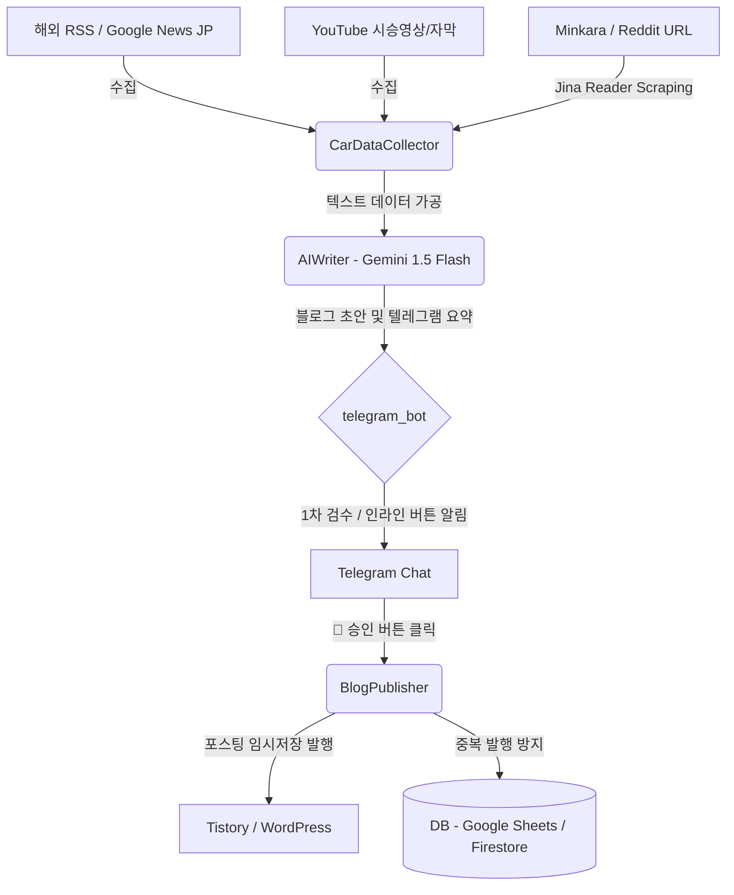

# 🚗 Auto Car Blog Backend Automation Pipeline (Phase 1)

해외 자동차 뉴스 및 오너 커뮤니티 데이터를 수집하여 AI로 심층 분석하고, 다중 플랫폼(티스토리, 워드프레스) 포스팅 초안 발행과 텔레그램 알림/제어를 연결하는 백엔드 파이프라인 자동화 시스템입니다.

---

## 🛠 시스템 아키텍처 및 연동 흐름


---

## 📂 파일 디렉토리 스펙

- `config.py`: 환경 변수 및 크레덴셜 통합 검증 및 파싱 모듈.
- `db.py`: Google Sheets / Firebase Firestore API 연동 및 로컬 JSON 캐시 폴백 처리 모듈.
- `collector.py`: Google News JP/KR RSS, Jina Reader 스크래핑, youtube-transcript-api 기반 자막 추출 및 HTML 메타 정보 수집 모듈.
- `prompts.py`: SEO/GEO 검색엔진 노출 및 모바일 독자 유입용 플랫폼별 프롬프트.
- `ai_writer.py`: Gemini SDK를 사용하여 반응형 HTML 및 마크다운으로 이루어진 전문 기사 초안 작성기.
- `publisher.py`: WordPress REST API 및 티스토리 API를 이용한 글쓰기 연동 (반응형 이미지 강제 보정 포함).
- `telegram_bot.py`: `/news` 및 `/briefing` 비동기 커맨드 핸들러, 인라인 버튼 Callback 핸들러.
- `main.py`: 로컬 구동(Polling + APScheduler) 및 Vercel 배포(FastAPI + Webhook + Cron) 통합 엔트리포인트.

---

## ⚙ 환경 설정 및 에셋 크레덴셜 가이드

프로젝트 루트 디렉토리에 `.env` 파일을 생성하고 다음 내용을 기입합니다. (상세 서식은 `.env.example` 참고)

### 1) 필수 기본 API 설정
- **GEMINI_API_KEY**: Google AI Studio 무료 티어에서 발급받은 API 키.
- **TELEGRAM_BOT_TOKEN**: BotFather를 통해 발급받은 봇 토큰.
- **TELEGRAM_CHAT_ID**: 데일리 자동 브리핑 알림을 수신할 대상(개인 챗방 혹은 채널)의 고유 ID.

### 2) 데이터베이스 중복 수집/발행 차단 설정
클라우드 DB 연동 정보가 누락되면, 자동으로 루트 디렉토리의 `cache.json` 및 `drafts_cache.json`을 사용하여 로컬 메모리 캐시로 동작합니다.
- **Google Sheets**:
  - `GOOGLE_SHEETS_SPREADSHEET_ID`: 구글 시트 URL에서 추출한 ID.
  - `GOOGLE_SHEETS_CREDENTIALS_JSON` 또는 `GOOGLE_SHEETS_CREDENTIALS_PATH`: Google Cloud Console에서 생성한 서비스 계정의 비공개 키 JSON 정보.
- **Firebase Firestore**:
  - `FIREBASE_CREDENTIALS_JSON` 또는 `FIREBASE_CREDENTIALS_PATH`: Firebase 콘솔에서 발급한 서비스 계정 JSON 정보.

### 3) 발행 플랫폼 API 설정
설정이 생략될 시 콘솔에 Dummy URL 링크를 반환하여 안전한 시뮬레이션 모드로 동작합니다.
- **Tistory**:
  - `TISTORY_ACCESS_TOKEN`: 티스토리 Open API 앱 등록 후 발급받은 사용자 토큰.
  - `TISTORY_BLOG_NAME`: 블로그 서브도메인 이름 (예: `car-tech` 인 경우 `car-tech.tistory.com`).
- **WordPress**:
  - `WORDPRESS_URL`: WordPress 사이트 최상위 도메인 주소.
  - `WORDPRESS_USERNAME`: 로그인 사용자 이름.
  - `WORDPRESS_APPLICATION_PASSWORD`: WordPress 관리자 설정 -> 사용자 편집에서 생성한 공백이 포함된 24자리 애플리케이션 비밀번호.

---

## 🚀 실행 및 배포 방법

### 1) 로컬 PC에서 실행하기 (개발 & 테스트)
```bash
# 1. 패키지 설치
pip install -r requirements.txt

# 2. .env 작성 (필요한 값 세팅)
# 3. 로컬 봇 및 스케줄러 실행
python main.py
```
- 로컬 실행 시, 매일 아침 `08:00`에 자동으로 `Google News JP` 핫이슈를 분석하여 텔레그램으로 승인 요청 카드를 전송합니다.
- 텔레그램 봇에서 `/news [차종명]`을 전송하여 즉각 수집 작동 테스트를 할 수 있습니다.

### 2) Vercel Serverless 배포하기
1. **GitHub 연동**: 해당 레포지토리를 GitHub에 업로드합니다.
2. **Vercel 프로젝트 생성**:
   - Vercel 대시보드에서 `Import Project`를 실행합니다.
   - 프로젝트 환경 변수(Environment Variables) 설정란에 `.env`에 정의된 변수들을 모두 기입합니다.
3. **서버리스 모드 설정**:
   - 환경 변수 `RUN_MODE`의 값을 `vercel`로 주입합니다.
4. **텔레그램 웹훅 연동**:
   - Vercel 배포 완료 후 제공되는 도메인 주소를 이용해 브라우저에 아래 주소를 입력하여 웹훅을 등록합니다:
     `https://api.telegram.org/bot<TELEGRAM_BOT_TOKEN>/setWebhook?url=https://<YOUR-VERCEL-DOMAIN>/api/webhook`
5. **크론 스케줄 등록**:
   - Vercel Cron (`vercel.json` 등을 활용) 또는 외부 크론 트리거 서비스를 통해 매일 특정 시간에 `https://<YOUR-VERCEL-DOMAIN>/api/cron` 주소로 GET 요청을 하도록 설정합니다.
